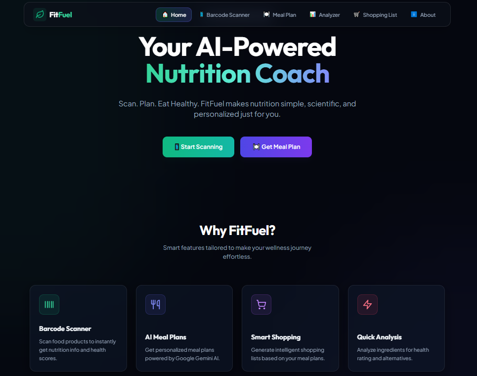
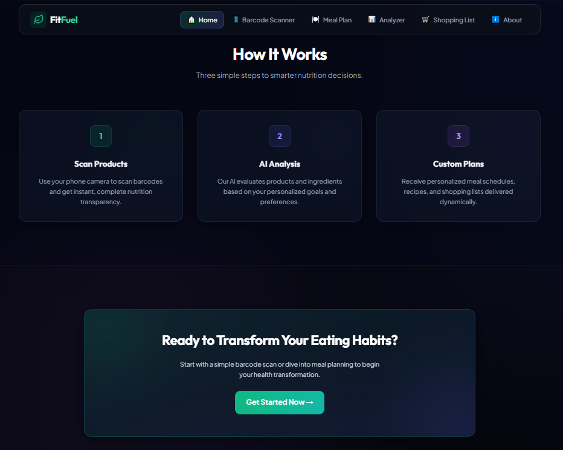
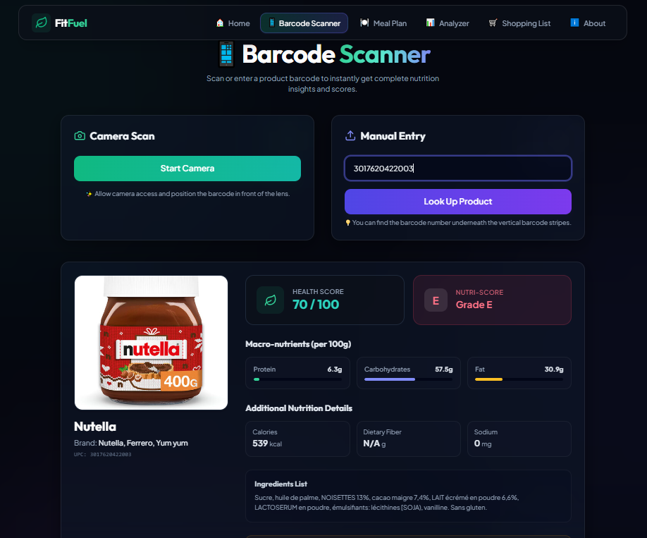
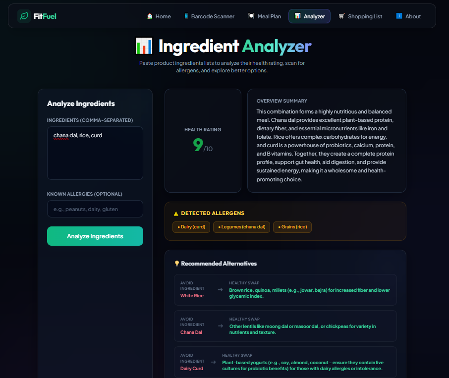
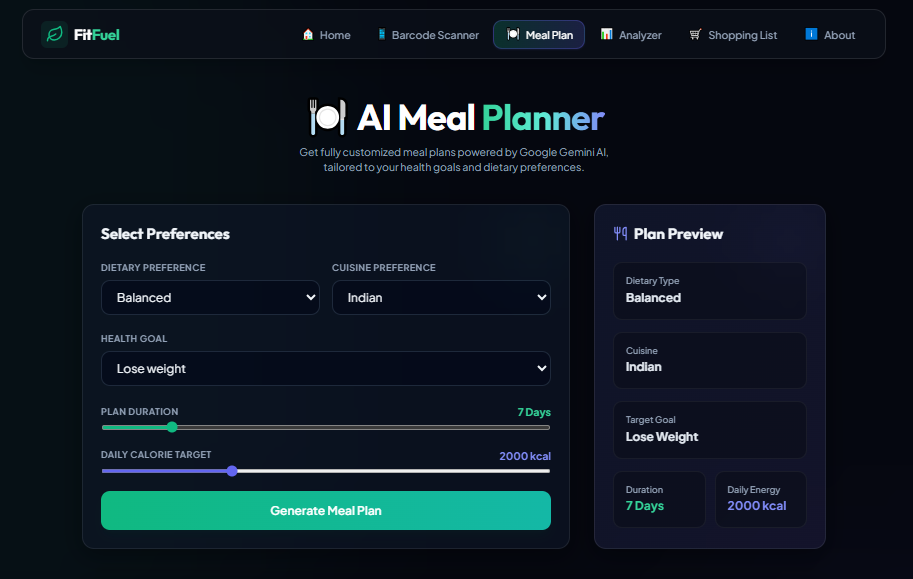
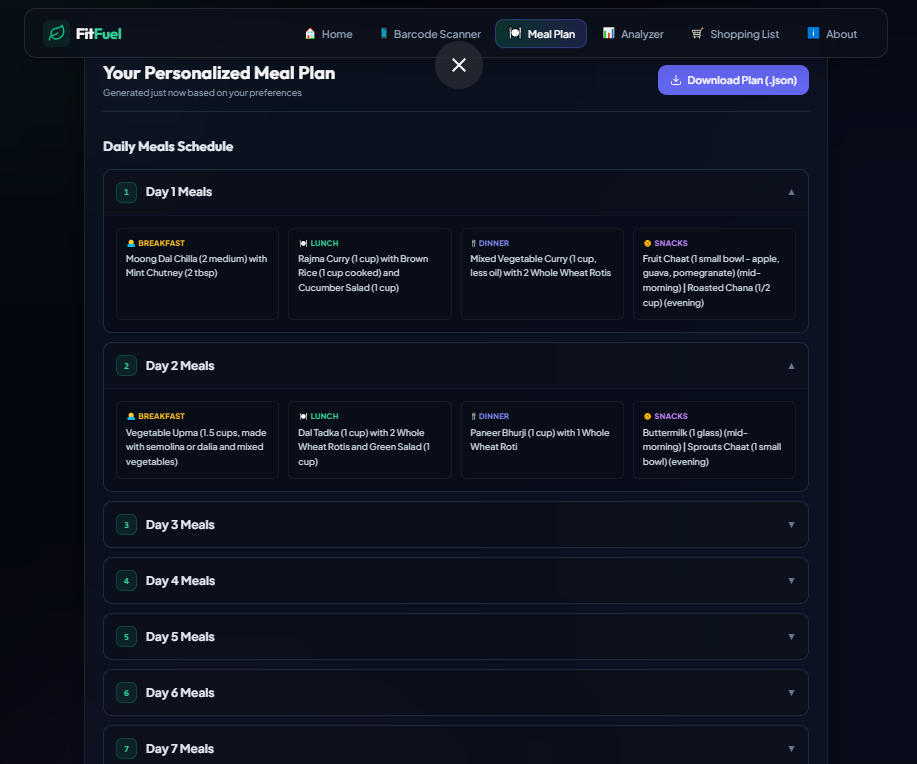
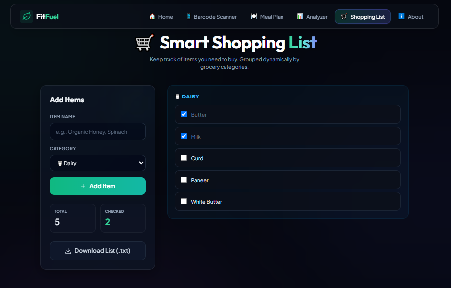
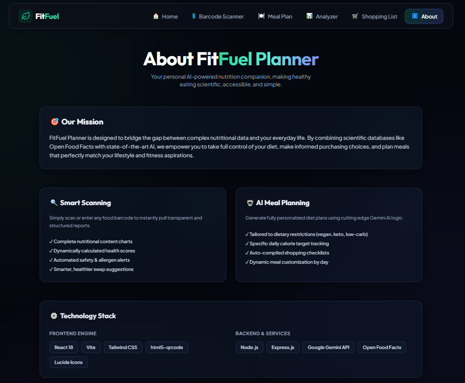

# 🥗 FitFuel Planner

<div align="center">

### 🚀 AI-Powered Nutrition Assistant for Smarter Food Choices

Scan Food • Analyze Ingredients • Generate Meal Plans • Shop Smarter

</div>

---

## 📖 Overview

FitFuel Planner is an AI-powered nutrition assistant designed to help users make healthier dietary decisions through barcode scanning, ingredient analysis, allergen detection, and personalized meal planning.

The platform combines **Google Gemini AI** with the **Open Food Facts API** to provide real-time nutrition insights, explain ingredients in simple language, suggest healthier alternatives, and generate customized meal plans tailored to user preferences and health goals.

---

## ✨ Key Features

- 📷 Barcode-Based Food Product Analysis
- 🤖 AI Ingredient Analyzer
- ⚠️ Allergen Detection
- 🍽️ Personalized Meal Planning
- 🛒 Smart Shopping List Generator
- 🥗 Nutrition Insights & Health Scores
- 🇮🇳 Indian Cuisine Support
- 📊 Healthier Food Recommendations

---

# 🏠 Home Page

The landing page introduces users to FitFuel Planner and highlights its core features, including barcode scanning, AI meal planning, smart shopping assistance, and ingredient analysis.



---

# ⚙️ How It Works

FitFuel Planner simplifies nutrition planning into three easy steps:

### 1️⃣ Scan Products
Scan food barcodes using your device camera.

### 2️⃣ AI Analysis
Analyze ingredients, allergens, and nutritional quality.

### 3️⃣ Personalized Plans
Receive customized meal plans and shopping lists.



---

# 📷 Barcode Scanner

The Barcode Scanner enables users to scan or manually enter product barcodes to retrieve detailed food information instantly.

### Features

- Camera-based barcode scanning
- Manual barcode lookup
- Nutrition information
- Ingredient transparency
- Health score evaluation
- Nutri-Score display

### Technologies Used

- HTML5 QR Code Scanner
- Open Food Facts API
- React.js



---

# 🧪 Ingredient Analyzer

The Ingredient Analyzer helps users understand what goes into their food by evaluating ingredient quality and detecting allergens.

### Features

- AI-powered ingredient analysis
- Ingredient explanations in simple language
- Allergen detection
- Health rating system
- Nutritional summaries
- Healthier alternative recommendations

### Powered By

- Google Gemini AI
- React.js
- Express.js



---

# 🍽️ AI Meal Planner

Generate personalized meal plans based on:

- Dietary preferences
- Cuisine preferences
- Health goals
- Calorie requirements
- Plan duration

### Supported Diet Types

- Balanced
- Vegetarian
- Vegan
- High Protein
- Weight Loss Plans

### Supported Cuisines

- Indian
- Custom Meal Preferences



---

# 📋 Generated Meal Plan

FitFuel Planner uses Google Gemini AI to create complete day-wise meal schedules containing:

- Breakfast
- Lunch
- Dinner
- Snacks

Each plan is customized according to user goals and nutritional requirements.



---

# 🛒 Smart Shopping List

The Smart Shopping List automatically organizes grocery items into categories and helps users track items efficiently.

### Features

- Categorized grocery lists
- Checklist functionality
- Downloadable shopping lists
- Meal-plan-based shopping assistance



---

# ℹ️ About FitFuel Planner

The About section explains the mission behind FitFuel Planner and the technologies powering the application.

### Mission

To bridge the gap between complex nutritional information and everyday food choices through AI-driven insights and personalized guidance.



---

# 🏗️ Tech Stack

## Frontend

- React.js
- Vite
- Tailwind CSS
- Lucide React
- HTML5 QR Code Scanner

## Backend

- Node.js
- Express.js

## AI & APIs

- Google Gemini AI
- Open Food Facts API

## Utilities

- Axios
- CORS
- Dotenv

---

# 📂 Project Structure

```text
FitFuel-Planner
│
├── screenshots
│   ├── home.png
│   ├── how-it-works.png
│   ├── barcode-scanner.png
│   ├── meal-planner.png
│   ├── meal-plan-result.png
│   ├── ingredient-analyzer.png
│   ├── shopping-list.png
│   └── about.png
│
├── src
│   ├── components
│   │   ├── Navbar.jsx
│   │   └── ProductCard.jsx
│   │
│   ├── pages
│   │   ├── About.jsx
│   │   ├── BarcodeScanner.jsx
│   │   ├── LandingPage.jsx
│   │   ├── MealPlanGenerator.jsx
│   │   ├── ProductAnalyzer.jsx
│   │   └── ShoppingList.jsx
│   │
│   ├── App.jsx
│   └── main.jsx
│
├── server.js
├── package.json
├── vite.config.js
└── .env
```

---

# ⚙️ Installation

### Clone Repository

```bash
git clone https://github.com/souravrana06/FitFule-Planner.git
```

### Navigate to Project

```bash
cd FitFule-Planner
```

### Install Dependencies

```bash
npm install
```

### Configure Environment Variables

Create a `.env` file:

```env
GEMINI_API_KEY=your_api_key_here
```

### Run Frontend

```bash
npm run dev
```

### Run Backend

```bash
npm start
```

---

# 🎯 Future Enhancements

- User Authentication
- Nutrition History Tracking
- Fitness Goal Integration
- Personalized Dashboard
- Mobile Application
- Advanced Product Comparison
- AI Calorie Tracking

---

# 👨‍💻 Author

### Sourav Rana

🔗 GitHub: https://github.com/souravrana06

🔗 LinkedIn: https://www.linkedin.com/in/souravrana06/

---

<div align="center">

### ⭐ If you found this project useful, consider giving it a star!

Made with ❤️ using React, Node.js, Express.js, Google Gemini AI, and Open Food Facts API.

</div>
